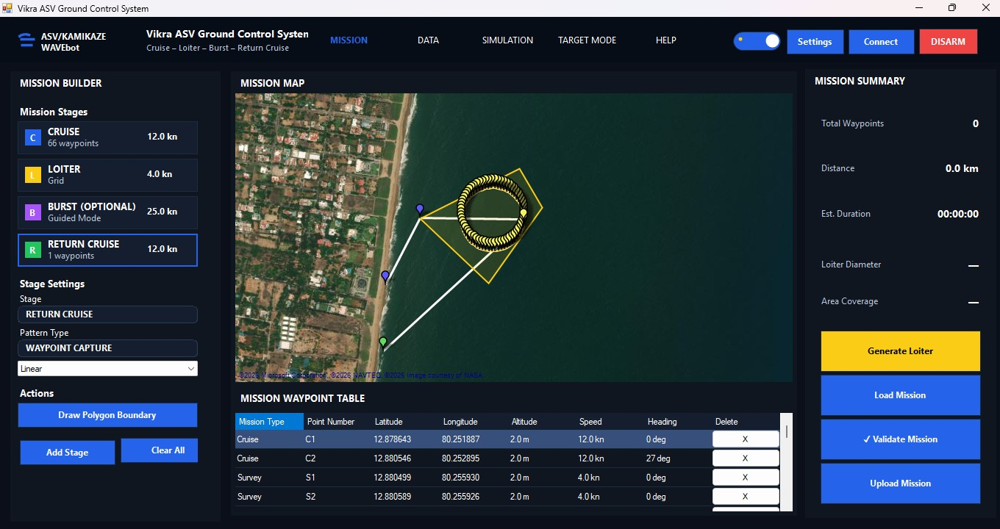

<div align="center">

# 🚤 Vikra ASV Ground Control System

### Professional Ground Control Software for Autonomous Surface Vehicles (ASV)

Mission Planning • Simulation • Pixhawk Integration • MAVLink • Mission Planner SDK


</div>

---

<p align="center">

</p>

# ✨ Project Highlights

- 🚤 Professional Ground Control Station (GCS) for Autonomous Surface Vehicles
- 🛰 Mission Planner SDK & MAVLink Integration
- 📍 Interactive Mission Planning & Waypoint Management
- 🗺 GMap.NET Based Mission Visualization
- ▶ Built-in Mission Simulation Engine
- 🎯 Target Mode Interface
- 🌙 Professional Light & Dark Theme Engine
- 📖 Integrated Help System
- ⚙ Modular C# WinForms Architecture

---

# ✨ Overview

The **Vikra ASV Ground Control System (GCS)** is a professional Windows desktop application developed for planning, simulating, monitoring, and managing missions for **Autonomous Surface Vehicles (ASVs)**.

The system provides an end-to-end mission workflow that allows operators to:

- Design multi-stage autonomous missions
- Simulate mission execution before deployment
- Upload missions directly to Pixhawk flight controllers
- Monitor telemetry and vehicle status
- Visualize mission progress on an interactive map
- Operate through a professional Light and Dark themed interface

Built using **C#**, **WinForms**, **Mission Planner SDK**, **MAVLink**, and **GMap.NET**, the application focuses on delivering a reliable operator experience for marine autonomous systems.

# 🚀 Key Features

## 🗺 Mission Planning

- Multi-stage mission workflow
- Cruise Mission
- Loiter Mission
- Burst Mission
- Return Cruise
- Interactive waypoint editing
- Polygon survey generation
- Mission validation

---

## 🛰 Pixhawk Integration

- Mission Planner SDK integration
- MAVLink communication
- Connect / Disconnect vehicle
- Mission Upload
- Mission Verification

---

## ▶ Simulation

- Vehicle simulation
- Mission playback
- Pause / Resume
- ETA calculation
- Distance tracking

---

## 📊 Data Monitoring

- Live telemetry dashboard
- GPS monitoring
- Vehicle status
- Battery status
- Interactive map

---

## 🎯 Target Mode

- Live camera interface
- Target visualization
- Future target locking support

---

## 🎨 User Experience

- Professional Dark Theme
- Professional Light Theme
- Recursive Theme Engine
- Responsive UI

---

# 📸 Screenshot Gallery

## 🗺 Mission Planning

<p align="center">

</p>

Design complete autonomous missions using Cruise, Loiter, Burst and Return Cruise stages. Create survey patterns, edit waypoints interactively, validate missions and prepare them for deployment.

---

## 📊 Live Telemetry & Data Monitoring

<p align="center">

</p>

Monitor vehicle telemetry through an operator-friendly dashboard featuring GPS status, battery information, mission progress, live map visualization and camera feeds.

---

## ▶ Mission Simulation

<p align="center">

</p>

Simulate complete ASV missions before deployment. Visualize mission execution, monitor ETA, pause/resume simulations and verify mission behaviour before uploading.

---

## 🎯 Target Mode

<p align="center">

</p>

Dedicated operator interface prepared for future intelligent target monitoring, visualization and mission interaction.

---

## ❓ Integrated Help System

<p align="center">

</p>

A built-in operator help system providing workflow guidance, mission documentation and user assistance directly inside the application.

---

## 🌙 Dark & ☀ Light Themes

<p align="center">


</p>

A fully integrated recursive theme engine provides consistent Light and Dark mode experiences across every page of the application.

---

# 🏗 Software Architecture

```
                        WinForms User Interface
                                 │
                                 ▼
                        Mission Manager Layer
                                 │
                                 ▼
                    Mission Planner Adapter
                                 │
                                 ▼
                    Mission Planner SDK Libraries
                                 │
                                 ▼
                           MAVLink Protocol
                                 │
                                 ▼
                         Pixhawk Flight Controller
```

---

# ⚙ Technology Stack

| Category | Technology |
|-----------|------------|
| Language | C# |
| Framework | .NET Framework |
| UI | Windows Forms |
| Mapping | GMap.NET |
| Communication | MAVLink |
| Flight Controller | Pixhawk |
| Backend | Mission Planner SDK |
| IDE | Visual Studio |
| Version Control | Git & GitHub |

---

# 📂 Project Structure

```
VikraASVMissionPlanner

├── Assets
├── Mission Managers
├── Models
├── Services
├── UI Components
├── Mission Planner Adapter
├── Settings
├── Help System
├── Theme Engine
├── Simulation
└── Pixhawk Integration
```

---

# 🚀 Current Status

Current Stable Release

**Version v1.2.0**

### Completed Modules

- ✅ Mission Planning
- ✅ Pixhawk Communication
- ✅ Mission Upload
- ✅ Mission Simulation
- ✅ Target Mode
- ✅ Help System
- ✅ Professional Theme Engine
- ✅ Light & Dark Themes
- ✅ Interactive Mapping
- ✅ MAVLink Integration

---

# 🛣 Future Roadmap

### Planned Improvements

- Multi Vehicle Support
- Advanced Telemetry Dashboard
- ROS Integration
- Autonomous Target Tracking
- Sensor Fusion
- Mission Recording
- Advanced Vehicle Diagnostics
- Middleware Framework
- Cross Platform Support

---

# 👨‍💻 About the Project

The **Vikra ASV Ground Control System** has been developed as part of software engineering work focused on mission planning, simulation and autonomous marine vehicle operations.

The project demonstrates practical implementation of desktop application development, Mission Planner SDK integration, MAVLink communication, Pixhawk mission management and modern operator interface design.

The software continues to evolve with future work planned around robotics middleware, telemetry expansion and autonomous vehicle capabilities.

---

# 📜 License

This repository is intended for educational and portfolio purposes.

Mission Planner libraries and other third-party components remain subject to their respective licenses.

# 📈 Project Timeline

- ✅ v1.0.0 – Initial Ground Control System
- ✅ v1.1.0 – Settings Module & UI Enhancements
- ✅ v1.2.0 – Professional Theme Engine & UI Optimization

Future Releases

- 🔄 v1.2.1 – Field Testing Improvements
- 🚀 v1.3.0 – Advanced Features & Middleware

---

<div align="center">

### Built using C#, WinForms, Mission Planner SDK, MAVLink and Pixhawk

**Vikra ASV Ground Control System**

© 2026 Syed Mohamed Faizal

</div>